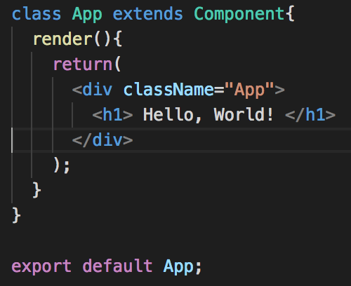

# Creating a React App… From Scratch.



React doesn’t ‘just work’ out of the box. It uses keywords and syntax that node (as of v. 9.3.0, which we’re using for this tutorial) hasn’t quite caught up to just yet. It requires a fair bit of setup that can be cumbersome to figure out, and Facebook has provided an option that makes starting a React app easy. Why bother, right?

The thing is, create-react-app abstracts a lot of what makes a React app work away from you — at least without ejecting it and having to tweak all of the options by hand. There are a number of reasons you may want to make your own implementation, or at least have some idea of what it’s doing under the hood.

As I mentioned, there are a couple of hurdles to starting a React app. The first is that node can’t process all of the syntax (such as import/export and jsx). The second is that you’ll either need to build your files or serve them somehow during development for your app to work — This is especially important in the latter situation.

Luckily, we can handle these issues with Babel and Webpack.

## Setup
To get started, create a new directory for your React app. Then, initialize your project with `npm init` and open it in an editor of your choice. It’s also a pretty good time to `git init` as well. In your new project folder, create the following structure:

```
.
+-- public
+-- src
```
Thinking ahead a little bit, we’ll eventually want to build our app and we’ll probably want to exclude the built version and our node modules from commits, so let’s go ahead and add a 
`.gitignore` file excluding (at least) the directories `node_modules` and `dist`.

Our `public` directory will handle any static assets, and most importantly houses our `index.html` file, which react will utilize to render your app. The following code was sourced from the react documentation with some very slight modifications. Feel free to copy the following HTML markup into a new file `index.html` inside of the `public` directory.

```html

<!-- sourced from https://raw.githubusercontent.com/reactjs/reactjs.org/master/static/html/single-file-example.html -->
<!DOCTYPE html>
<html>

<head>
  <meta charset="UTF-8" />
  <meta name="viewport" content="width=device-width, initial-scale=1, shrink-to-fit=no">
  <title>React Starter</title>
</head>

<body>
  <div id="root"></div>
  <noscript>
    You need to enable JavaScript to run this app.
  </noscript>
  <script src="../dist/bundle.js"></script>
</body>

</html>
```

The most important lines to pay attention to are 10, which is the root our React app will hook into, and line 14, which references our (soon to be) built react app. You can name your built script whatever you like, but I’ll be using bundle.js for this tutorial.

Now that we’ve got our HTML page set up, we can start getting serious. We’re going to need to set up a few more things. First, we need to make sure the code we write can be compiled, so we’ll need Babel.

## Babel
Go ahead and run `npm install --save-dev @babel/core@7.1.0 @babel/cli@7.1.0 @babel/preset-env@7.1.0 @babel/preset-react@7.0.0.`

`babel-core` is the main babel package — We need this for babel to do any transformations on our code. `babel-cli` allows you to compile files from the command line. **[preset-react](https://babeljs.io/docs/en/babel-preset-react)** and **[preset-env](https://babeljs.io/docs/en/babel-preset-env)** are both presets that transform specific flavors of code — in this case, the `env` preset allows us to transform ES6+ into more traditional javascript and the `react` preset does the same, but with JSX instead.

In the project root, create a file called **[.babelrc](https://babeljs.io/docs/en/config-files/)**. Here, we’re telling babel that we’re going to use the `env` and `react` presets.

```json
{
  "presets": ["@babel/env", "@babel/preset-react"]
}
```
Babel also has a ton of plugins available that can be used if you only need to transform specific features or some feature you need isn’t covered by env. We won’t worry about those for now, but you can check them out **[here](https://babeljs.io/docs/en/plugins/)**.

## Webpack
Now we need to acquire and configure Webpack. We’ll need a few more packages, and you’ll want to save these as dev dependencies: `npm install --save-dev webpack@4.19.1 webpack-cli@3.1.1 webpack-dev-server@3.1.8 style-loader@0.23.0 css-loader@1.0.0 babel-loader@8.0.2`.

Webpack uses **[loaders](https://webpack.js.org/loaders/)** to process different types of files for bundling. It also works easily alongside the development server that we’re going to use to serve our React project in development and reload browser pages on (saved) changes to our React components. In order to utilize any of this though, we’ll need to configure Webpack to use our loaders and prepare the dev server.

Create a new file at the root of the project called `webpack.config.js`. This file exports an object with webpack’s configuration.

```js
const path = require("path");
const webpack = require("webpack");

module.exports = {
  entry: "./src/index.js",
  mode: "development",
  module: {
    rules: [
      {
        test: /\.(js|jsx)$/,
        exclude: /(node_modules|bower_components)/,
        loader: "babel-loader",
        options: { presets: ["@babel/env"] }
      },
      {
        test: /\.css$/,
        use: ["style-loader", "css-loader"]
      }
    ]
  },
  resolve: { extensions: ["*", ".js", ".jsx"] },
  output: {
    path: path.resolve(__dirname, "dist/"),
    publicPath: "/dist/",
    filename: "bundle.js"
  },
  devServer: {
    contentBase: path.join(__dirname, "public/"),
    port: 3000,
    publicPath: "http://localhost:3000/dist/",
    hotOnly: true
  },
  plugins: [new webpack.HotModuleReplacementPlugin()]
};
```

Let’s take a quick walk through this: **[entry](https://webpack.js.org/configuration/entry-context/#entry)** (line 5) tells Webpack where our application starts and where to start bundling our files. The following line lets webpack know we’re working in development mode — This saves us from having to add a mode flag when we run the development server.

The **[module](https://webpack.js.org/configuration/module/)** object helps define how your exported javascript modules are transformed and which ones are included according to the given array of rules.

Our first rule is all about transforming our ES6 and JSX syntax. The test and exclude properties are conditions to match file against. In this case, it’ll match anything outside of the `node_modules` and `bower_components` directories. Since we’ll be transforming our `.js` and `.jsx` files as well, we’ll need to direct Webpack to use Babel. Finally, we specify that we want to use the `env` preset in options.

The next rule is for processing CSS. Since we’re not pre-or-post-processing our CSS, we just need to make sure to add `style-loader` and `css-loader` to the `use` property. `css-loader` requires `style-loader` in order to work. `loader` is a shorthand for the `use` property, when only one loader is being utilized.

The resolve property allows us to specify which extensions Webpack will resolve — this allows us to import modules without needing to add their extensions.

The output property tells Webpack where to put our bundled code. The publicPath property specifies what directory the bundle should go in, and also tells `webpack-dev-server` where to serve files from.

The publicPath property is a special property that helps us with our dev-server. It specifies the public URL of the the directory — at least as far as webpack-dev-server will know or care. If this is set incorrectly, you’ll get 404’s as the server won’t be serving your files from the correct location!

We set up `webpack-dev-server` in the **[devServer](https://webpack.js.org/configuration/dev-server/)** property. This doesn’t require much for our needs — just the location we’re serving static files from (such as our `index.html`) and the port we want to run the server on. Note that `devServer` also has a publicPath property. This `publicPath` tells the server where our bundled code actually is.

That last bit might have been a little confusing — Pay really close attention here: `output.publicPath` and `devServer.publicPath` are different. Read both entries. Twice.

Finally, since we want to use **[Hot Module Replacement](https://webpack.js.org/guides/hot-module-replacement/)** so we don’t have to constantly refresh to see our changes. All we do for that in terms of this file is instantiate a new instance of the plugin in the `plugins` property and make sure that we set `hotOnly` to `true` in `devServer`. We still need to set up one more thing in React before HMR works, though.

We’re done with the heavy setup. Now let’s get React working!

## React

First, we’ll need to get two more packages: `react@16.5.2` and `react-dom@16.5.2`. Go ahead and save those as regular dependencies.

We’ll need to tell our React app where to hook into the DOM (in our `index.html`). Create a file called `index.js` in your `src` directory. This is a very small file that does a lot in terms of your React app. Check it out.

```js
import React from "react";
import ReactDOM from "react-dom";
import App from "./App.js";
ReactDOM.render(<App />, document.getElementById("root"));
```
`ReactDOM.render` is the function that tells React what to render and where to render it — In this case, we’re rendering a component called `App` (which we’ll create soon), and it’s being rendered at the DOM element with the ID root (line 10 of `index.html`).

Now, create another file in `src` called `App.js`. If you’ve worked with React using `create-react-app` this part should be extremely familiar. This file is just a React component.

```js
import React, { Component} from "react";
import "./App.css";

class App extends Component{
  render(){
    return(
      <div className="App">
        <h1> Hello, World! </h1>
      </div>
    );
  }
}

export default App;
```
While we’re still here, I did mention that webpack also processes CSS (and we are requiring it our component). Let’s add a really simple stylsheet to the src directory.

```css
.App {
  margin: 1rem;
  font-family: Arial, Helvetica, sans-serif;
}
```

Your final project structure should look like the following, unless you changed some names along the way:

```shell
.
+-- public
| +-- index.html
+-- src
| +-- App.css
| +-- App.js
| +-- index.js
+-- .babelrc
+-- .gitignore
+-- package-lock.json
+-- package.json
+-- webpack.config.js
```
We now have a functioning react app! We can start our dev server by executing `webpack-dev-server --mode development` in the terminal. I would advise putting it in your `start` script in `package.json` to save yourself nine whole keystrokes.

## Finishing HMR

If you run the server now, you’ll notice none of your changes actually cause anything to happen in the client. What gives?

Well, HMR needs to know what to actually replace and currently we haven’t given it anything. For that, we’re going to use a package one of the folks on the react team have provided us: `react-hot-loader@4.3.11`.

You can install this as regular dependency — as per the documentation

:::tip
Note: You can safely install react-hot-loader as a regular dependency instead of a dev dependency as it automatically ensures it is not executed in production and the footprint is minimal.
:::

Now, import react-hot-loader in App.js and mark the exported object as hot-reloaded by modifying to code as follows.

```js
import React, { Component} from "react";
import {hot} from "react-hot-loader";
import "./App.css";

class App extends Component{
  render(){
    return(
      <div className="App">
        <h1> Hello, World! </h1>
      </div>
    );
  }
}

export default hot(module)(App);
```
When you run your app now changes to the code should update the client immediately after saving.

## Last Details
You might notice something interesting (or maybe startling) about starting your project: Built files never show up in your `dist` directory. See, `webpack-dev-server` is actually serving the bundled files from memory — once the server stops, they’re gone. To actually build your files, we’re going to utilize webpack proper — add a script called build in your `package.json` with the following command: `webpack --mode development`. You can replace `development` with `production`, but if you completely omit `--mode`, it will fall back to the latter and give you a warning.

That just about covers everything you need to be able to render a basic React app, without having to touch `create-react-app`. There’s still more to add to the implementation to make it more complete though — For instance, images aren’t set up to be processed by Webpack, but there’s a loader for that. I’ll leave that implementation to you. After all, if you don’t need or want to serve files, well, that’s just bloat, right?

I hope this article helped shine some light on what it takes to get a React app working, and how the basics work under the hood. I didn’t dive too deeply into details about Babel and Webpack, but please explore any of the myriad links peppered throughout the article or right into their documentation. They’re awesome tools that seem more intimidating at first glance than they really are and they can help take your development to the next level.

If you’re still unclear on any of that or want another reference, here’s **[the repository on github](https://github.com/paradoxinversion/creating-a-react-app-from-scratch)** . **[You can also check out an older implementation](https://github.com/paradoxinversion/react-starter)** (it goes a bit more in depth) or say hi on twitter.


[原文链接](https://medium.com/@JedaiSaboteur/creating-a-react-app-from-scratch-f3c693b84658)